# Preca — court-debt (precatório) pipeline

**A full-stack system to run the buy side of Brazilian *precatórios***: intake, OCR of court
documents, explainable matching with buyers, quotes, negotiation and a stage pipeline with SLA
alerts. NestJS + Prisma + PostgreSQL on the back, React on the front, one shared rules package.

[Português (Brasil)](README.pt-BR.md) · [Live demo](https://fabianoarthur.github.io/Sistema-de-Precatorio/) · [Deployment](docs/deployment.md) · [Contributing](CONTRIBUTING.md)

[](https://github.com/FabianoArthur/Sistema-de-Precatorio/actions/workflows/ci.yml)
[](https://github.com/FabianoArthur/Sistema-de-Precatorio/actions/workflows/pages.yml)


<picture>
  <source media="(prefers-color-scheme: dark)" srcset="docs/assets/screenshots/dashboard-dark.png">
  
</picture>

## Try it

**[Open the live demo](https://fabianoarthur.github.io/Sistema-de-Precatorio/)** and press
*Entrar* — the credentials are already filled in. The demo runs entirely in your browser against
an in-memory backend with **fictitious data**; reloading the page resets everything. The UI is
in Brazilian Portuguese, like the domain.

## What it is

A *precatório* is a debt that a Brazilian government body owes after losing a lawsuit. Payment
can take years, so creditors often sell the right at a discount. The firms that intermediate
those sales need to:

1. take in a case and its court document,
2. check the numbers against what the court actually issued,
3. find which funds and banks would buy it,
4. collect quotes, negotiate with the seller and push the paperwork to the deed.

Preca covers that flow end to end, for a small team.

## Why it is interesting

- **OCR with a human in the loop.** An uploaded court order goes through `pdf-parse`, falls back
  to Tesseract for scanned files, and a court-specific parser (federal courts, TJSP, TJRJ)
  extracts case number, amounts, court, division and date. The app never overwrites data
  silently: it shows each **divergence between the document and the record** and lets the user
  apply the OCR value field by field.
- **Explainable buyer matching.** Each buyer declares what it accepts (federal cases, states,
  cities, risk scores). The match rule scores every buyer and says **why** it matched or which
  rule blocked it, so a quote request is never a black box.
- **A pipeline that tracks time.** Eleven stages, moving forwards or backwards, each move kept
  in the history. A daily job flags cases stalled longer than the SLA and notifies the team.
- **Audit log you can trust.** Every service that changes data writes the change **and** its
  audit entry in the same Prisma transaction.
- **One source of truth for rules.** Zod schemas, the score and the matching rule live in
  `packages/shared` and run unchanged in the API, in the forms and in the demo.
- **A demo that is the real front end.** The Pages build swaps the HTTP transport for an
  in-memory backend that answers the same routes and reuses the same domain rules. No server,
  no fake screenshots, and none of that code reaches the production bundle (CI checks it).

<table>
  <tr>
    <td width="50%">
      <picture>
        <source media="(prefers-color-scheme: dark)" srcset="docs/assets/screenshots/detalhe-ocr-dark.png">
        
      </picture>
      <p align="center"><sub>OCR divergences, applied field by field</sub></p>
    </td>
    <td width="50%">
      <picture>
        <source media="(prefers-color-scheme: dark)" srcset="docs/assets/screenshots/cotacoes-dark.png">
        
      </picture>
      <p align="center"><sub>Suggested buyers and why they match</sub></p>
    </td>
  </tr>
</table>

## Architecture

<picture>
  <source media="(prefers-color-scheme: dark)" srcset="docs/assets/architecture-dark.svg">
  
</picture>

| Part | Stack |
|---|---|
| `apps/api` | NestJS 10 · Prisma 6 · PostgreSQL 16 · JWT (Passport) · Zod via `nestjs-zod` · Swagger · `@nestjs/schedule` · Sentry (optional) |
| `apps/web` | React 18 · Vite 6 · TanStack Query · React Hook Form · Tailwind + shadcn/ui · nuqs (filters in the URL) · Sentry (optional) |
| `packages/shared` | Zod schemas, enums, `calcularScore`, `avaliarMatch` |
| Tooling | pnpm workspaces · Turborepo · Biome · Husky + commitlint · Jest · Vitest · Playwright · GitHub Actions |

The domain vocabulary in code is Portuguese on purpose (`precatorio`, `cedente` = seller,
`comprador` = buyer, `cotacao` = quote), so names match the business language.

The diagram is generated by `node scripts/build-diagram.mjs`.

## Running locally

Requirements: Node.js 22, pnpm 10 (`corepack enable`), Docker.

```bash
pnpm install
docker compose up -d                                  # PostgreSQL on :5432
cp apps/api/.env.example apps/api/.env
cp apps/web/.env.example apps/web/.env
pnpm --filter @preca/api prisma:migrate               # create the schema
pnpm --filter @preca/api prisma:seed                  # two local users
pnpm dev                                              # API :3001 · web :5173
```

- Web: <http://localhost:5173> — sign in with `admin@preca.local` / `admin123` (local seed only;
  change `SEED_USER_*` before seeding anything real).
- API docs (Swagger): <http://localhost:3001/docs>

**No database?** Run the same front end as the public demo:

```bash
pnpm --filter @preca/web build:demo && pnpm --filter @preca/web preview
```

## Tests

| Suite | Tool | What it covers | Tests |
|---|---|---|---|
| `packages/shared` | Vitest | buyer matching, score thresholds | 12 |
| `apps/api` | Jest | OCR parsers for federal courts, TJSP and TJRJ, value and date parsing | 15 |
| `apps/web` | Vitest | in-memory backend (routes, stage moves, SLA, quotes), OCR divergences, formatting | 23 |
| `apps/web/e2e` | Playwright | real API + PostgreSQL: login, navigation, notifications, PDF upload | 9 |
| `apps/web/e2e-demo` | Playwright | demo build under the Pages base path: login, URL filters, applying OCR | 4 |

```bash
pnpm test                                  # unit tests (builds shared first through Turborepo)
pnpm --filter @preca/web e2e:demo          # no backend needed
pnpm --filter @preca/web e2e               # needs API + PostgreSQL running (see CONTRIBUTING)
```

CI runs lint, type-check, build, all of the above, a check that no demo code reaches the
production bundle, and a gitleaks scan of the full history.

## Project layout

```
apps/
  api/        NestJS modules: auth, precatorios, cedentes, compradores, cotacoes,
              negociacoes, anexos (+ ocr/), notificacoes (+ SLA job), dashboard, audit-log
  web/        React app; src/features/* mirrors the API modules; src/demo is the
              in-memory backend used by the Pages build
packages/
  shared/     schemas, enums and domain rules shared by both apps
scripts/      build-diagram.mjs
docs/         deployment guide, diagram and screenshots
```

## Deployment

The live demo deploys to GitHub Pages on every push to `main`. Running the full stack in
production (API on Fly.io or any Docker host, PostgreSQL, web on any static host) is described in
[docs/deployment.md](docs/deployment.md).

## License

[MIT](LICENSE) © 2026 Fabiano Arthur. All names, companies, tax IDs and case numbers in the demo
and tests are fictitious.
