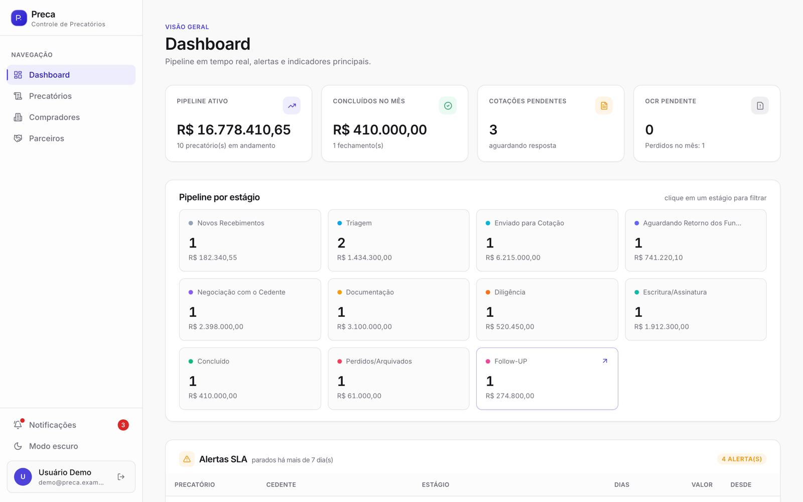
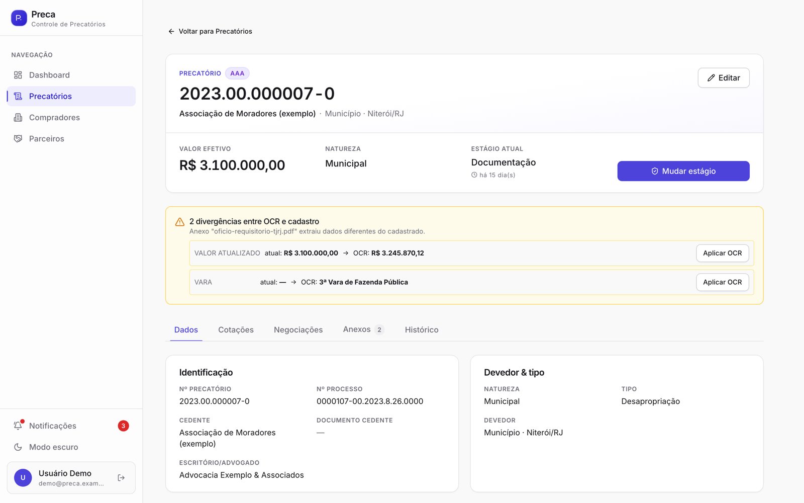
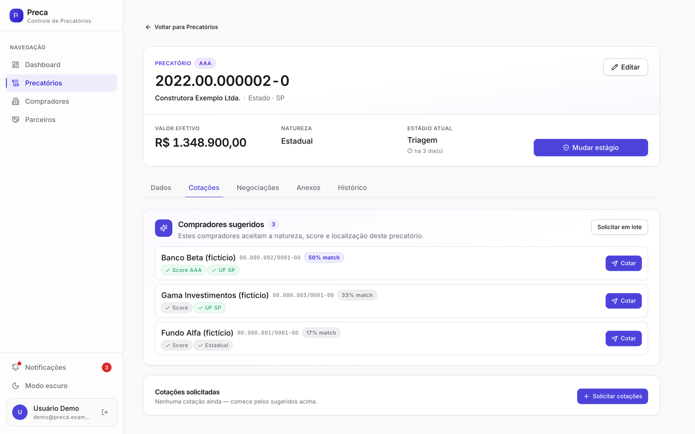

# Preca — pipeline de precatórios

**Sistema full-stack para operar a compra de precatórios**: entrada do caso, OCR do ofício,
match explicável com compradores, cotações, negociação e um pipeline de estágios com alertas de
SLA. NestJS + Prisma + PostgreSQL no back, React no front, um pacote de regras compartilhado.

[English](README.md) · [Demo ao vivo](https://fabianoarthur.github.io/Sistema-de-Precatorio/) · [Deploy](docs/deployment.md) · [Como contribuir](CONTRIBUTING.md)

[](https://github.com/FabianoArthur/Sistema-de-Precatorio/actions/workflows/ci.yml)
[](https://github.com/FabianoArthur/Sistema-de-Precatorio/actions/workflows/pages.yml)


<picture>
  <source media="(prefers-color-scheme: dark)" srcset="docs/assets/screenshots/dashboard-dark.png">
  
</picture>

## Experimente

**[Abra a demo](https://fabianoarthur.github.io/Sistema-de-Precatorio/)** e clique em *Entrar*
— as credenciais já vêm preenchidas. A demo roda inteira no seu navegador, contra um backend em
memória com **dados fictícios**; recarregar a página reinicia tudo.

## O que é

Precatório é a dívida que um ente público reconhece depois de perder um processo. O pagamento
pode levar anos, então muitos credores vendem o direito com deságio. Quem intermedeia essa venda
precisa:

1. receber o caso e o ofício do tribunal,
2. conferir os números com o que o tribunal de fato expediu,
3. descobrir quais fundos e bancos comprariam,
4. juntar cotações, negociar com o cedente e levar a papelada até a escritura.

O Preca cobre esse fluxo de ponta a ponta, para uma equipe pequena.

## Por que é interessante

- **OCR com revisão humana.** O ofício enviado passa pelo `pdf-parse`, cai no Tesseract quando o
  PDF é escaneado, e um parser por tribunal (TRFs, TJSP, TJRJ) extrai número, processo, valores,
  tribunal, vara e data. O app nunca sobrescreve em silêncio: mostra cada **divergência entre o
  documento e o cadastro** e deixa aplicar o valor do OCR campo a campo.
- **Match de compradores explicável.** Cada comprador declara o que aceita (federal, UFs,
  municípios, scores). A regra pontua cada um e diz **por que** casou ou qual regra bloqueou, então
  pedir cotação nunca é caixa-preta.
- **Pipeline que mede o tempo.** Onze estágios, indo para frente ou para trás, cada mudança no
  histórico. Um job diário aponta o que está parado além do SLA e notifica a equipe.
- **Audit log confiável.** Todo service que altera dados grava a mudança **e** a entrada do audit
  log na mesma transação do Prisma.
- **Uma fonte de verdade para as regras.** Schemas Zod, score e regra de match ficam em
  `packages/shared` e rodam iguais na API, nos formulários e na demo.
- **A demo é o front de verdade.** O build do Pages troca o transporte HTTP por um backend em
  memória que responde às mesmas rotas e reusa as mesmas regras. Sem servidor, sem print
  montado, e nada desse código chega ao bundle de produção (o CI confere).

<table>
  <tr>
    <td width="50%">
      <picture>
        <source media="(prefers-color-scheme: dark)" srcset="docs/assets/screenshots/detalhe-ocr-dark.png">
        
      </picture>
      <p align="center"><sub>Divergências do OCR, aplicadas campo a campo</sub></p>
    </td>
    <td width="50%">
      <picture>
        <source media="(prefers-color-scheme: dark)" srcset="docs/assets/screenshots/cotacoes-dark.png">
        
      </picture>
      <p align="center"><sub>Compradores sugeridos e o motivo do match</sub></p>
    </td>
  </tr>
</table>

## Arquitetura

<picture>
  <source media="(prefers-color-scheme: dark)" srcset="docs/assets/architecture.pt-BR-dark.svg">
  
</picture>

| Parte | Stack |
|---|---|
| `apps/api` | NestJS 10 · Prisma 6 · PostgreSQL 16 · JWT (Passport) · Zod via `nestjs-zod` · Swagger · `@nestjs/schedule` · Sentry (opcional) |
| `apps/web` | React 18 · Vite 6 · TanStack Query · React Hook Form · Tailwind + shadcn/ui · nuqs (filtros na URL) · Sentry (opcional) |
| `packages/shared` | schemas Zod, enums, `calcularScore`, `avaliarMatch` |
| Ferramentas | pnpm workspaces · Turborepo · Biome · Husky + commitlint · Jest · Vitest · Playwright · GitHub Actions |

O diagrama é gerado por `node scripts/build-diagram.mjs`.

## Rodando localmente

Requisitos: Node.js 22, pnpm 10 (`corepack enable`), Docker.

```bash
pnpm install
docker compose up -d                                  # PostgreSQL na :5432
cp apps/api/.env.example apps/api/.env
cp apps/web/.env.example apps/web/.env
pnpm --filter @preca/api prisma:migrate               # cria o schema
pnpm --filter @preca/api prisma:seed                  # dois usuários locais
pnpm dev                                              # API :3001 · web :5173
```

- Web: <http://localhost:5173> — entre com `admin@preca.local` / `admin123` (só no seed local;
  troque `SEED_USER_*` antes de semear qualquer ambiente real).
- Documentação da API (Swagger): <http://localhost:3001/docs>

**Sem banco?** Rode o mesmo front da demo pública:

```bash
pnpm --filter @preca/web build:demo && pnpm --filter @preca/web preview
```

## Testes

| Suíte | Ferramenta | O que cobre | Testes |
|---|---|---|---|
| `packages/shared` | Vitest | match de compradores, limites do score | 12 |
| `apps/api` | Jest | parsers de OCR (TRFs, TJSP, TJRJ), leitura de valores e datas | 15 |
| `apps/web` | Vitest | backend em memória (rotas, estágios, SLA, cotações), divergências do OCR, formatação | 23 |
| `apps/web/e2e` | Playwright | API real + PostgreSQL: login, navegação, notificações, upload de PDF | 9 |
| `apps/web/e2e-demo` | Playwright | build demo no caminho base do Pages: login, filtros na URL, aplicar OCR | 4 |

```bash
pnpm test                                  # testes unitários (o Turborepo builda o shared antes)
pnpm --filter @preca/web e2e:demo          # não precisa de backend
pnpm --filter @preca/web e2e               # precisa de API + PostgreSQL rodando (ver CONTRIBUTING)
```

O CI roda lint, type-check, build, tudo acima, uma checagem de que nenhum código da demo chega
ao bundle de produção e o gitleaks no histórico inteiro.

## Estrutura

```
apps/
  api/        módulos NestJS: auth, precatorios, cedentes, compradores, cotacoes,
              negociacoes, anexos (+ ocr/), notificacoes (+ job de SLA), dashboard, audit-log
  web/        app React; src/features/* espelha os módulos da API; src/demo é o
              backend em memória usado no build do Pages
packages/
  shared/     schemas, enums e regras de domínio dos dois apps
scripts/      build-diagram.mjs
docs/         guia de deploy, diagrama e prints
```

## Deploy

A demo publica no GitHub Pages a cada push na `main`. Subir a stack completa em produção (API no
Fly.io ou qualquer host Docker, PostgreSQL, web em qualquer host estático) está em
[docs/deployment.md](docs/deployment.md).

## Licença

[MIT](LICENSE) © 2026 Fabiano Arthur. Todos os nomes, empresas, documentos e números de processo
da demo e dos testes são fictícios.
